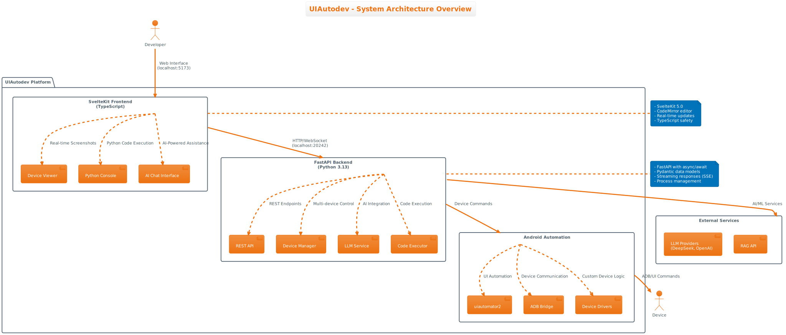

# UIAutodev

A sophisticated Android UI automation platform that combines AI-powered analysis with interactive development capabilities. UIAutodev provides a modern web interface for controlling Android devices, executing Python automation scripts, and leveraging LLM services for intelligent UI testing and automation.

## Quick Start

### Prerequisites
- NixOS or Nix package manager
- Android device with USB debugging enabled
- ADB (Android Debug Bridge) configured

### Setup

```bash
# Clone the repository
git clone <repository-url>
cd uiagent

# Enter Nix development environment (automatic with direnv)
nix develop

# Start development servers
./start-dev.sh
```

The application will be available at:
- **Frontend**: http://localhost:5173 (SvelteKit dev server)
- **Backend API**: http://localhost:20242 (FastAPI with auto-docs at /docs)

## Architecture



UIAutodev follows a modern microservices-style architecture with clear separation between the web frontend, API backend, and Android device automation layer:

- **Frontend**: SvelteKit 5.0 with TypeScript for the web interface
- **Backend**: Python 3.13 with FastAPI for REST API and device orchestration
- **Automation**: uiautomator2 and ADB for Android device control
- **AI Integration**: Modular LLM provider system with streaming capabilities

## Key Features

### Android Device Automation
- **Multi-device Support**: Connect and control multiple Android devices simultaneously
- **UI Hierarchy Analysis**: Real-time UI element inspection and interaction
- **Screenshot Capture**: High-quality device screenshots with element overlay
- **App Management**: Install, launch, and manage Android applications

### AI-Powered Development
- **LLM Integration**: Pluggable LLM providers (DeepSeek, OpenAI, etc.)
- **Intelligent Automation**: AI-driven UI testing and script generation
- **RAG Support**: Code snippet retrieval and contextual assistance
- **Streaming Responses**: Real-time AI interaction via Server-Sent Events

### Interactive Python Console
- **Code Execution**: Execute Python automation scripts in real-time
- **Jedi Autocompletion**: Intelligent code completion and suggestions
- **Process Management**: Background task execution with interrupt capabilities
- **Device API Access**: Direct access to connected Android devices

### Modern Development Experience
- **Hot Reload**: Instant frontend and backend reloading during development
- **Type Safety**: Full TypeScript frontend with Pydantic backend models
- **API Documentation**: Auto-generated API docs with interactive testing
- **Nix Environment**: Reproducible development environment with all dependencies

## Technology Stack

### Core Technologies
- **Backend**: Python 3.13, FastAPI, Uvicorn ASGI server
- **Frontend**: TypeScript, SvelteKit 5.0, Vite 6.2.6
- **Android**: uiautomator2, adbutils, custom device drivers
- **AI/ML**: Modular LLM provider system with streaming support
- **Development**: Nix flakes, direnv for environment management

### Key Libraries
- **Code Editing**: CodeMirror 6 with Python syntax highlighting and Vim mode
- **Image Processing**: PIL/Pillow for screenshot manipulation and OCR
- **Configuration**: YAML/JSON with environment variable support
- **Testing**: pytest with coverage reporting (pytest-cov)

## Documentation

### User Guides
- [Development Setup](docs/DEVELOPMENT.md) - Complete development environment setup
- [API Documentation](docs/API.md) - REST API endpoints and usage examples
- [Deployment Guide](docs/DEPLOYMENT.md) - Production deployment procedures

### Technical Documentation
- [Architecture Overview](docs/ARCHITECTURE.md) - Detailed system architecture and design
- [Security Guidelines](docs/SECURITY.md) - Security best practices and configuration
- [Performance Guide](docs/PERFORMANCE.md) - Optimization and monitoring strategies

### Operational Documentation
- [Troubleshooting](docs/TROUBLESHOOTING.md) - Common issues and solutions
- [Monitoring Setup](docs/MONITORING.md) - Monitoring and alerting configuration

## Recent Updates

UIAutodev has undergone significant refactoring with:
- **Flattened Directory Structure**: Simplified imports and module organization
- **Modern Tech Stack**: Updated to latest versions of SvelteKit, Vite, and Python
- **Enhanced UI Components**: Improved screenshot viewer, element selection, and hierarchy scrolling
- **Streamlined Development**: Single-command development server startup

## Contributing

1. **Environment Setup**: Use `nix develop` to enter the development environment
2. **Development Workflow**: Run `./start-dev.sh` to start both frontend and backend
3. **Testing**: Execute `pytest` for backend tests, frontend tests via `npm run check`
4. **Code Quality**: All code is automatically formatted and linted

## License

[License information to be added]

---

**Version**: See `__init__.py` for current version
**Platform Support**: Linux, macOS (with Nix), NixOS
**Python Version**: 3.13+
**Node Version**: As specified in frontend package.json