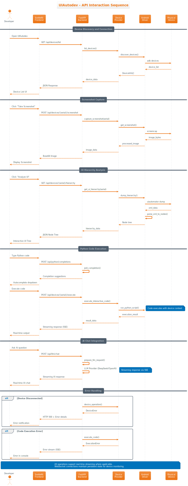

# UIAutodev API Documentation

## Overview

UIAutodev provides a comprehensive REST API built with FastAPI for Android device automation, Python code execution, and AI-powered assistance. The API supports both synchronous and asynchronous operations with real-time streaming capabilities.

**Base URL**: `http://localhost:20242`
**Interactive Documentation**: `http://localhost:20242/docs`
**OpenAPI Schema**: `http://localhost:20242/openapi.json`



## Authentication

Currently, UIAutodev operates in development mode without authentication. All endpoints are accessible without credentials.

**Note**: In production deployments, implement appropriate authentication mechanisms such as:
- API Keys for service-to-service communication
- JWT tokens for user authentication
- OAuth2 for external integrations

## Core API Endpoints

### System Information

#### Get Application Info
```http
GET /api/info
```

Returns system information and configuration details.

**Response**:
```json
{
  "version": "1.0.0",
  "platform": "linux",
  "python_version": "3.13.0",
  "services": {
    "llm_enabled": true,
    "device_automation": true
  }
}
```

#### Get Service Configuration
```http
GET /api/config/services
```

Returns available service providers and their status.

**Response**:
```json
{
  "llm_providers": ["deepseek", "openai"],
  "device_providers": ["android"],
  "features": {
    "code_execution": true,
    "streaming_responses": true,
    "multi_device": true
  }
}
```

### Device Management

#### List Connected Devices
```http
GET /api/devices/list
```

Returns all connected Android devices.

**Response**:
```json
[
  {
    "serial": "RF8M802WZ0X",
    "model": "SM-G973F",
    "name": "Galaxy S10",
    "status": "device",
    "enabled": true
  }
]
```

#### Execute Shell Command
```http
POST /api/devices/{serial}/shell
```

Execute a shell command on the specified Android device.

**Request Body**:
```json
{
  "command": "getprop ro.build.version.release"
}
```

**Response**:
```json
{
  "output": "11\n",
  "error": null
}
```

#### Capture Device Screenshot
```http
POST /api/devices/{serial}/screenshot
```

Capture a screenshot from the specified Android device.

**Response**:
```json
{
  "image_data": "data:image/png;base64,iVBORw0KGgoAAAANSUhEUgAA...",
  "width": 1080,
  "height": 2340,
  "timestamp": "2025-09-19T10:30:00Z"
}
```

#### Get UI Hierarchy
```http
GET /api/devices/{serial}/hierarchy
```

Retrieve the current UI hierarchy from the Android device.

**Response**:
```json
{
  "root": {
    "key": "root",
    "name": "application",
    "bounds": [0, 0, 1080, 2340],
    "rect": {
      "x": 0,
      "y": 0,
      "width": 1080,
      "height": 2340
    },
    "properties": {
      "class": "android.widget.FrameLayout",
      "package": "com.android.systemui"
    },
    "children": [...]
  }
}
```

#### Touch Interaction
```http
POST /api/devices/{serial}/tap
```

Perform touch interactions on the device.

**Request Body**:
```json
{
  "x": 540,
  "y": 1170,
  "duration": 100
}
```

**Response**:
```json
{
  "success": true,
  "message": "Touch executed successfully",
  "coordinates": {"x": 540, "y": 1170}
}
```

#### Application Management
```http
POST /api/devices/{serial}/install_app
```

Install an APK on the Android device.

**Request Body**:
```json
{
  "apk_path": "/path/to/app.apk",
  "replace": true
}
```

**Response**:
```json
{
  "success": true,
  "package_name": "com.example.app",
  "message": "Application installed successfully"
}
```

### Python Code Execution

#### Get Code Completions
```http
POST /api/python/completions
```

Get intelligent code completion suggestions using Jedi.

**Request Body**:
```json
{
  "code": "import os\nos.get",
  "line": 1,
  "column": 8,
  "filename": "script.py"
}
```

**Response**:
```json
[
  {
    "text": "getcwd",
    "displayText": "getcwd()",
    "type": "function"
  },
  {
    "text": "getenv",
    "displayText": "getenv(key, default=None)",
    "type": "function"
  }
]
```

#### Execute Interactive Python Code
```http
POST /api/devices/{serial}/interactive_python
```

Execute Python code with access to the device context.

**Request Body**:
```json
{
  "code": "print(f'Device: {device.serial}')\nscreenshot = device.screenshot()\nprint(f'Screenshot size: {screenshot.size}')",
  "context": {
    "variables": {},
    "imports": ["uiautomator2 as u2"]
  }
}
```

**Response** (Streaming via Server-Sent Events):
```
data: {"type": "stdout", "content": "Device: RF8M802WZ0X\n"}
data: {"type": "stdout", "content": "Screenshot size: (1080, 2340)\n"}
data: {"type": "result", "content": null, "execution_complete": true}
```

#### Interrupt Code Execution
```http
POST /api/python/interrupt
```

Interrupt a running Python process.

**Request Body**:
```json
{
  "serial": "RF8M802WZ0X"
}
```

**Response**: `204 No Content`

### AI/LLM Integration

#### Chat with LLM
```http
POST /api/llm/chat
```

Send chat messages to LLM providers with streaming responses.

**Request Body**:
```json
{
  "prompt": "Help me automate this Android app",
  "context": {
    "device_info": {
      "serial": "RF8M802WZ0X",
      "current_app": "com.example.app"
    },
    "ui_hierarchy": {...}
  },
  "history": [
    {
      "role": "user",
      "content": "What elements are clickable on this screen?"
    }
  ],
  "provider": "deepseek",
  "model": "deepseek-chat",
  "temperature": 0.7,
  "max_tokens": 1000
}
```

**Response** (Streaming via Server-Sent Events):
```
data: {"type": "message", "content": "I can see several clickable elements on this screen:\n"}
data: {"type": "message", "content": "1. The login button at coordinates (540, 1200)\n"}
data: {"type": "message", "content": "2. The settings icon in the top-right corner\n"}
data: {"type": "complete", "finish_reason": "stop"}
```

### Image Processing

#### OCR Image Analysis
```http
POST /api/ocr_image
```

Perform OCR (Optical Character Recognition) on uploaded images.

**Request**: Multipart form data with image file

**Response**:
```json
[
  {
    "key": "text_1",
    "name": "Login",
    "bounds": [450, 1180, 630, 1220],
    "rect": {
      "x": 450,
      "y": 1180,
      "width": 180,
      "height": 40
    },
    "properties": {
      "text": "Login",
      "confidence": 0.95
    },
    "confidence": 0.95,
    "children": []
  }
]
```

## Streaming Endpoints

UIAutodev supports real-time streaming for several operations using Server-Sent Events (SSE).

### Server-Sent Events Format

```
data: {"type": "stdout", "content": "Output line\n"}
data: {"type": "stderr", "content": "Error message\n"}
data: {"type": "result", "content": {"value": 42}, "execution_complete": true}
```

### Streaming Operations

1. **Python Code Execution**: Real-time output from running scripts
2. **LLM Chat Responses**: Streaming AI responses as they're generated
3. **Device Monitoring**: Live updates of device status and events

## Error Handling

### Standard Error Responses

All endpoints return structured error responses with appropriate HTTP status codes:

```json
{
  "detail": "Error description",
  "error_code": "DEVICE_NOT_FOUND",
  "timestamp": "2025-09-19T10:30:00Z"
}
```

### Common Status Codes

- `200 OK`: Successful request
- `201 Created`: Resource created successfully
- `204 No Content`: Successful request with no response body
- `400 Bad Request`: Invalid request format or parameters
- `404 Not Found`: Resource not found (device, process, etc.)
- `422 Unprocessable Entity`: Request validation failed
- `500 Internal Server Error`: Server-side error
- `501 Not Implemented`: Feature not implemented for current provider

### Error Categories

#### Device Errors
- `DEVICE_NOT_FOUND`: Device with specified serial not connected
- `DEVICE_OFFLINE`: Device is connected but not responsive
- `ADB_ERROR`: Android Debug Bridge communication error

#### Execution Errors
- `CODE_EXECUTION_ERROR`: Python code execution failed
- `SYNTAX_ERROR`: Invalid Python syntax
- `PROCESS_NOT_FOUND`: No active process to interrupt

#### Service Errors
- `LLM_PROVIDER_ERROR`: AI service provider unavailable
- `COMPLETION_ERROR`: Code completion service failed
- `OCR_ERROR`: Image processing failed

## Rate Limiting

Currently, no rate limiting is implemented. In production environments, consider implementing:

- **Per-IP rate limiting**: Prevent abuse from single sources
- **Per-device rate limiting**: Limit device operations to prevent damage
- **LLM usage limits**: Control costs for AI service usage

## SDK and Client Libraries

### Python Client Example

```python
import requests
import json

class UIAutodevClient:
    def __init__(self, base_url="http://localhost:20242"):
        self.base_url = base_url

    def list_devices(self):
        response = requests.get(f"{self.base_url}/api/devices/list")
        return response.json()

    def capture_screenshot(self, serial):
        response = requests.post(
            f"{self.base_url}/api/devices/{serial}/screenshot"
        )
        return response.json()

    def execute_code(self, serial, code):
        response = requests.post(
            f"{self.base_url}/api/devices/{serial}/interactive_python",
            json={"code": code}
        )
        return response.json()

# Usage
client = UIAutodevClient()
devices = client.list_devices()
print(f"Found {len(devices)} devices")
```

### JavaScript/TypeScript Client Example

```typescript
class UIAutodevClient {
  constructor(private baseUrl = 'http://localhost:20242') {}

  async listDevices(): Promise<DeviceInfo[]> {
    const response = await fetch(`${this.baseUrl}/api/devices/list`);
    return response.json();
  }

  async captureScreenshot(serial: string): Promise<ScreenshotResponse> {
    const response = await fetch(
      `${this.baseUrl}/api/devices/${serial}/screenshot`,
      { method: 'POST' }
    );
    return response.json();
  }

  // Server-Sent Events for streaming
  subscribeToCodeExecution(
    serial: string,
    code: string,
    onMessage: (data: any) => void
  ) {
    const eventSource = new EventSource(
      `${this.baseUrl}/api/devices/${serial}/interactive_python`
    );

    eventSource.onmessage = (event) => {
      const data = JSON.parse(event.data);
      onMessage(data);
    };

    return eventSource;
  }
}
```

## API Versioning

The current API is version 1.0. Future versions will maintain backward compatibility with appropriate versioning strategies:

- **URL Versioning**: `/api/v2/devices/list`
- **Header Versioning**: `Accept: application/vnd.uiautodev.v2+json`
- **Query Parameter**: `/api/devices/list?version=2`

## Development and Testing

### Testing with curl

```bash
# List devices
curl -X GET "http://localhost:20242/api/devices/list"

# Execute shell command
curl -X POST "http://localhost:20242/api/devices/RF8M802WZ0X/shell" \
  -H "Content-Type: application/json" \
  -d '{"command": "getprop ro.build.version.release"}'

# Get code completions
curl -X POST "http://localhost:20242/api/python/completions" \
  -H "Content-Type: application/json" \
  -d '{
    "code": "import os\nos.get",
    "line": 1,
    "column": 8,
    "filename": "script.py"
  }'
```

### Interactive API Documentation

FastAPI provides interactive documentation at `http://localhost:20242/docs` with:

- **Try It Out**: Execute API calls directly from the documentation
- **Request/Response Examples**: Real examples for all endpoints
- **Schema Definitions**: Complete data model documentation
- **Authentication Testing**: Test authentication when implemented

---

For more technical details about the API implementation, see the [Architecture Documentation](ARCHITECTURE.md).