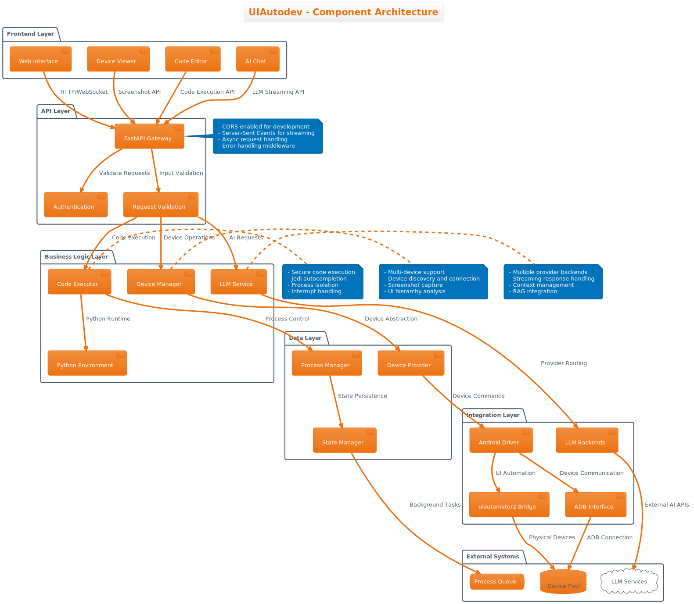
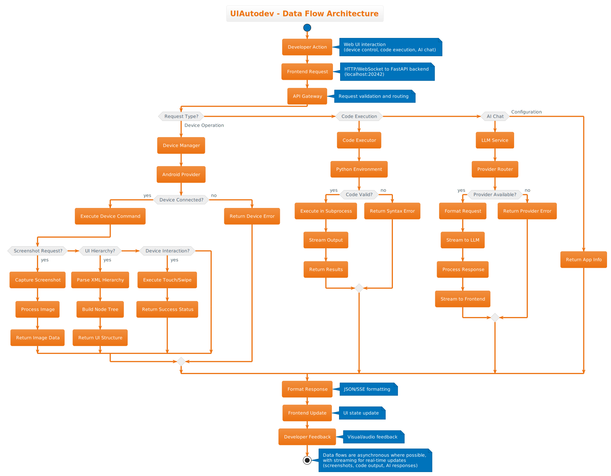

# UIAutodev Architecture

## System Overview


UIAutodev is a sophisticated Android UI automation platform built with a modern microservices-style architecture. The system provides a web-based interface for controlling Android devices, executing Python automation scripts, and leveraging AI/LLM services for intelligent testing and automation.

## Architecture Principles

### Separation of Concerns
- **Frontend Layer**: SvelteKit-based web interface for user interaction
- **API Layer**: FastAPI backend providing REST endpoints and WebSocket connections
- **Business Logic Layer**: Device management, code execution, and AI integration
- **Integration Layer**: Android device drivers and external service connectors

### Scalability and Performance
- **Asynchronous Processing**: FastAPI with async/await patterns throughout
- **Streaming Responses**: Server-Sent Events for real-time updates
- **Multi-device Support**: Concurrent management of multiple Android devices
- **Background Processing**: Isolated Python code execution with process management

## Component Architecture



### Frontend Layer

#### SvelteKit Web Interface
- **Technology**: SvelteKit 5.0 with TypeScript
- **Build Tool**: Vite 6.2.6 for fast development and optimized builds
- **Key Components**:
  - **Device Viewer**: Real-time screenshot display with UI element overlay
  - **Code Editor**: CodeMirror 6 with Python syntax highlighting and Vim mode
  - **AI Chat Interface**: Streaming chat interface for LLM interaction

#### Key Frontend Features
- **Hot Module Replacement**: Instant updates during development
- **Type Safety**: Full TypeScript integration with proper type definitions
- **Modern UI Components**: Responsive design with interactive elements
- **Real-time Updates**: WebSocket and SSE connections for live data

### API Layer

#### FastAPI Gateway
- **Technology**: Python 3.13 with FastAPI framework
- **ASGI Server**: Uvicorn for high-performance async request handling
- **Key Features**:
  - **Auto-generated Documentation**: Interactive API docs at `/docs`
  - **Request Validation**: Pydantic models for input/output validation
  - **CORS Support**: Configured for development with customizable origins
  - **Error Handling**: Structured exception handling with proper HTTP status codes

#### Authentication and Security
- **Development Mode**: CORS enabled for local development
- **Input Validation**: Comprehensive Pydantic model validation
- **Process Isolation**: Secure code execution in isolated Python processes
- **Error Sanitization**: Proper error handling to prevent information leakage

### Business Logic Layer

#### Device Management System
- **Provider Pattern**: Abstracted device provider interface
- **Multi-device Support**: Concurrent connection and control of multiple devices
- **Device Discovery**: Automatic detection of connected Android devices
- **State Management**: Real-time tracking of device states and capabilities

**Key Files**:
- `/home/aidev/tools/uiagent/provider.py` - Device provider abstraction
- `/home/aidev/tools/uiagent/driver/android.py` - Android-specific driver implementation
- `/home/aidev/tools/uiagent/router/device.py` - Device API endpoints

#### LLM Service Integration
- **Provider System**: Modular architecture supporting multiple LLM providers
- **Streaming Support**: Real-time streaming responses via Server-Sent Events
- **Context Management**: Conversation history and context preservation

**Supported Providers**:
- **DeepSeek**: Primary LLM provider for AI interactions
- **OpenAI**: Alternative provider with GPT model support
- **Extensible**: Plugin architecture for additional providers

**Key Files**:
- `/home/aidev/tools/uiagent/services/llm/` - LLM service implementation
- `/home/aidev/tools/uiagent/services/llm/backends/` - Provider backends

#### Python Code Execution Engine
- **Interactive Environment**: Python REPL with device context
- **Jedi Integration**: Intelligent autocompletion and code analysis
- **Process Management**: Isolated execution with interrupt capabilities
- **Device API Access**: Direct access to connected Android devices from code

**Key Features**:
- **Security**: Code execution in separate processes with proper isolation
- **Performance**: Efficient process management and cleanup
- **Developer Experience**: Full IDE-like features including autocompletion
- **Integration**: Seamless access to device automation APIs

### Integration Layer

#### Android Device Integration
- **uiautomator2**: Primary Android automation framework
- **ADB (Android Debug Bridge)**: Low-level device communication
- **Custom Drivers**: Enhanced device control with custom functionality

**Capabilities**:
- **UI Hierarchy Analysis**: Parse and analyze Android UI structure
- **Screenshot Capture**: High-quality device screenshots
- **Touch Interactions**: Tap, swipe, and gesture automation
- **App Management**: Install, launch, and control applications

#### Data Models and Types
- **Pydantic Models**: Comprehensive type safety throughout the system
- **Device Information**: Structured device metadata and status
- **UI Hierarchy**: Node-based representation of Android UI elements
- **Chat Messages**: Structured LLM conversation data

**Key Models** (from `/home/aidev/tools/uiagent/model.py`):
```python
class DeviceInfo(BaseModel):
    serial: str
    model: str
    name: str
    status: str
    enabled: bool

class Node(BaseModel):
    key: str
    name: str
    bounds: Optional[Tuple[float, float, float, float]]
    rect: Optional[Rect]
    properties: Dict[str, Union[str, bool]]
    children: List[Node]

class ChatMessageContent(BaseModel):
    role: str
    content: Union[str, List[Dict[str, Any]]]
    tool_calls: Optional[List[ToolCall]]
```

## Data Flow Architecture



### Request Processing Flow

1. **User Interaction**: Developer interacts with SvelteKit frontend
2. **API Gateway**: FastAPI receives and validates requests
3. **Business Logic**: Appropriate service processes the request
4. **Integration**: Device drivers or external services execute operations
5. **Response Streaming**: Results stream back to frontend via HTTP/WebSocket
6. **UI Updates**: Frontend updates in real-time with new data

### Key Data Flows

#### Device Operations
- **Screenshot Capture**: Device → ADB → Image Processing → Base64 → Frontend
- **UI Hierarchy**: Device → uiautomator2 → XML Parser → Node Tree → Frontend
- **Touch Interactions**: Frontend → API → Device Driver → uiautomator2 → Device

#### Code Execution
- **Python Scripts**: Frontend → API → Process Manager → Python Runtime → Results Stream
- **Autocompletion**: Code Context → Jedi Engine → Completion Suggestions → Frontend

#### AI Integration
- **Chat Requests**: Frontend → LLM Service → Provider Router → External AI API
- **Streaming Responses**: AI API → Server-Sent Events → Frontend Updates

## Development Environment

### Nix-based Development
- **Declarative Environment**: Complete development setup via `flake.nix`
- **Reproducible Builds**: Consistent environment across all development machines
- **Custom Package Builds**: Patched versions of specific dependencies
- **Environment Isolation**: No system-wide dependency conflicts

### Development Workflow
```bash
# Enter development environment
nix develop

# Start all services
./start-dev.sh

# Services available:
# - Frontend: http://localhost:5173
# - Backend: http://localhost:20242
# - API Docs: http://localhost:20242/docs
```

### Hot Reload and Development Features
- **Frontend Hot Reload**: Instant component updates with Vite
- **Backend Hot Reload**: Uvicorn `--reload` for Python changes
- **Type Checking**: Real-time TypeScript and Python type validation
- **Automated Testing**: pytest for backend, SvelteKit testing for frontend

## Deployment Architecture

### Development Deployment
- **Single Command Setup**: `./start-dev.sh` starts entire stack
- **Environment Management**: Nix handles all dependencies automatically
- **Development Servers**: Separate ports for frontend and backend with proxy

### Production Deployment Options

#### Container Deployment
- **Multi-stage Builds**: Separate build and runtime containers
- **Dependency Management**: Nix-based container builds for reproducibility
- **Service Orchestration**: Docker Compose or Kubernetes support

#### NixOS Deployment
- **Declarative Infrastructure**: NixOS expressions for server configuration
- **Atomic Deployments**: Rollback-capable deployments
- **Service Management**: Systemd integration for service lifecycle

#### Traditional Deployment
- **Python Virtual Environment**: Standard venv-based deployment
- **Static File Serving**: Built frontend served via reverse proxy
- **Process Management**: Systemd or supervisor for service management

## Security Considerations

### API Security
- **Input Validation**: Comprehensive Pydantic model validation
- **CORS Configuration**: Configurable cross-origin policies
- **Error Handling**: Sanitized error responses to prevent information disclosure

### Code Execution Security
- **Process Isolation**: Python code execution in separate processes
- **Resource Limits**: Configurable CPU and memory limits
- **Interrupt Handling**: Proper cleanup and termination of running processes

### Device Security
- **ADB Security**: Secure device communication via authenticated ADB
- **Permission Management**: Proper Android permission handling
- **Network Isolation**: Device communication over secure channels

## Performance Optimization

### Backend Performance
- **Async Architecture**: Non-blocking I/O throughout the application
- **Connection Pooling**: Efficient device connection management
- **Streaming Responses**: Reduced memory usage with streaming data
- **Process Management**: Efficient Python subprocess handling

### Frontend Performance
- **Code Splitting**: Automatic code splitting with SvelteKit
- **Tree Shaking**: Dead code elimination with Vite
- **Optimized Builds**: Production builds with minification and compression
- **Real-time Updates**: Efficient WebSocket and SSE connections

### Monitoring and Observability
- **Structured Logging**: Comprehensive logging throughout the application
- **Performance Metrics**: Built-in monitoring capabilities
- **Error Tracking**: Detailed error logging and reporting
- **Health Checks**: Endpoint health monitoring for deployment validation

## Integration Points

### External Service Integration
- **LLM Providers**: RESTful API integration with streaming support
- **Android Services**: Deep integration with Android debugging tools

### Extension Points
- **Provider Interface**: Pluggable device provider system
- **LLM Backends**: Modular LLM provider architecture
- **Custom Drivers**: Extensible device driver framework
- **Plugin System**: Future support for additional automation capabilities

---

This architecture provides a solid foundation for scalable Android automation with modern development practices, comprehensive type safety, and extensive integration capabilities.